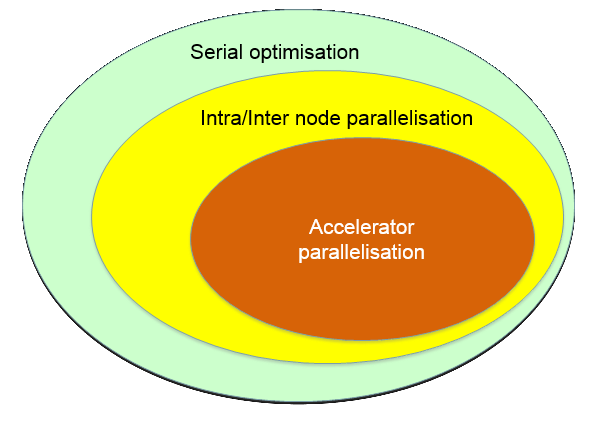

HPC and HTC Concepts
====================

Key Concepts
------------

High Performance Computing (HPC)

High Throughput Computing (HTC)

AKA **"Supercomputing"**

The Computer
------------

Traditional view of a computer is changing
------------------------------------------

* Pressure from *computing requirements*.

* Pressure from *Physics*.

Pressure from computing requirements
------------------------------------

**Example:** Large scale weather simulation

* Detailed description for atmosphere too large to run on today's desktops.

    * Multiple "desktops" are needed to hold all grid data.

    * "Desktops" need to quickly *communicate to synchronise* work over entire grid,

    * Communication between "desktops" can become a bottleneck.

Pressure from computing requirements
------------------------------------

**Example:** Searching database of web-sites for some text (i.e. Google)

* Searching sequentially through large volumes of text too time-consuming.

    * Multiple "desktops" hold different pages.

    * Each "desktop" can report the result of each individual search.

    * **The more "desktops" you add the quicker the search is.**

Pressure from physics
---------------------

* **Serial Process:**

    * A process in which its sub-processes happen sequentially in time.

    * Only one sub-process is active at any given time.

* **Parallel Process:**

    * Process in which a number of stages can occur during the same time interval (e.g. trans-parallel process).

Pressure from physics
---------------------

* **Serial Process:**

    * Speed depends only on the rate at which each sub-process will occur (e.g. processing unit clock speed).

* **Parallel Process:**

    * Speed depends on execution rate of each sub-process *AND* how many sub-processes can be made to occur simultaneously.

**Physics is limiting serial speed**

**Heat α speed³ **

Pressure from physics
---------------------
### All computers today are designed for parallel execution

But...

### Not all computation can be done in parallel!

Amdahl's Law
------------

1 Processor

Amdahl's Law
------------

2 Processors

Amdahl's Law
------------

10 Processors

Amdahl's Law
------------

* Amdahl's law will always be a limiting factor

$\frac{1}{\left(1-P\right)+\frac{P}{N}}$

* Some applications need to be re-written, algorithms re-thought to harness ever more parallel machines.

Amdahl's Law
------------

* If 95% of the program can be parallelized, the theoretical maximum speedup using parallel computing would be 20x, no matter how many processors are used.

There are many parallel paradigms
---------------------------------

Processor farms, pipelining, divide/conquer
Master/slave, geometric decomposition
cellular automata, algorithmic parallelism

* From a systems perspective:
    + Shared memory
    + Message passing

SMP (Symmetric Multi-Processing)
-------------------------------

SMP (Symmetric Multi-Processing)
-------------------------------

Beowulf Cluster
---------------

Infiniband Cluster
------------------

NUMA (Non-Uniform Memory Access)
--------------------------------

Interconnect comparions
-----------------------

| Interconnect   |  Typical MPI latency (microseconds) | Typical bandwidth (MB/s) |
|:---------------|:-----------------------------------:|:------------------------:|
| 1Gbs Ethernet  | 60-90                               | 90                       |
| 10Gbs Ethernet | 12-20                               | 800                      |
| Infiniband     | 2-4                                 | 250-1200                 |
| NUMALink 4     | ~1                                  | 3000                     |
| QPI            | ~0.5                                | 20000                    |

GPU accelerator
---------------

Only a subset of problems can be optimised
------------------------------------------

* Not all problems can be parallelised

* Not all parallel problems can be ported to accelerators

In summary
----------

* Developments in CPU architecture still continue: Moore’s law still valid

* Improvements to CPU architecture consist of increasing internal parallelism: hyper-threading, wider SIMD units, more cores per chip

* Accelerators are bringing more computing cycles to the table (albeit of a special type).

And that is just the compute side of the story
----------------------------------------------

Data storage and Network infrastructure need to keep up with computation and other data producing technologies...

* upgrading network infrastructure

* re-thinking data storage

    * SSD’s

    * parallel file systems

    * Multi-tiered storage

    * Map-Reduce data platforms

Supercomputing
--------------

Used efficiently, Supercomputers let you get **more** done **faster**.

They can be useful for a large number of types of work.

Applications
------------

The Cluster
===========

Overview
--------

The Node
--------

* Compute Node

    + Just computes - little else

    + Private IP address - no user access

* Login Node

    * User login

    * Interaction with job scheduler

    * Public IP address - connects to external network

Generic Software stack
----------------------

Real applications
-----------------

* FEA - Finite Element Analysis
    + The simulation of hard physical materials, e.g. metal, plastic

    + Crash test, product design, suitability for purpose

    + Examples: MSC Nastran, Ansys, LS-Dyna, Abaqus, ESI PAMCrash, Radioss

* CFD - Computational Fluid Dynamics

    + The simulation of soft physical materials, gases and fluids

    + Engine design, airflow, oil reservoir modelling

    + Examples: Fluent, Star-CD, CFX

* Geophysical Sciences

    + Seismic Imaging - taking echo traces and building a picture of the sub-earth geology

    + Reservoir Simulation - CFD specific to oil asset management

    + Examples: Omega, Landmark VIP and Pro/Max, Geoquest Eclipse

Real applications
-----------------

* Life Sciences

    + Understanding the living world - genome matching, protein folding, drug design, bioinformatics, organic chemistry

    + Examples: BLAST, Gaussian, LAMMPS, Trinity, Amber, NAMD

+ High Energy Physics

    + Understanding the atomic and sub-atomic world

    + Software from Fermi-Lab or CERN, or home-grown

* Financial Modelling
    
    + Meeting internal and external financial targets particularly regarding investment positions
    + VaR - Value at Risk - assessing the impact of economic and political factors on the bank’s investment portfolio
    + Trader Risk Analysis - what is the risk on a trader’s position, a group of traders

Operating system
----------------

* The vast majority of Clusters in the world use some flavour  
of *Unix* or *Linux* for their OS.

* The most common form of interaction with these systems is a "shell" or "command line".  

*(Which we are going to learn about using Legion’s Login nodes.)*

Operating system
----------------

* Clusters are very frequently used as a shared facility. 

* As such, work needs to be scheduled via a batch system.

* Jobs are queued and prioritised based on requested resources.

*(These are the focus of tomorrow’s session.)*
