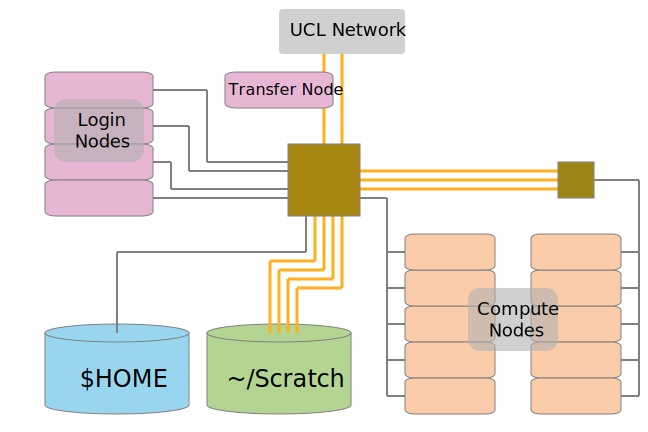
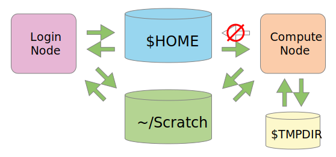

Legion Architecture
===================

Node Types
----------

* Login Nodes
* Transfer Node 
* Test Nodes 
* Compute Nodes 
* *(Infrastructure Nodes)*

Login Nodes
-----------

For:

* Access
* Programming
* File transfers (light)
* Testing (light)
* Visualisation (light)

Accessible via `ssh`, at `legion.rc.ucl.ac.uk`.

Transfer Node
-------------

At `login05.external.legion.ucl.ac.uk`.

Can transfer data around Legion up to 10x faster than normal login nodes.

User Test Nodes
---------------

* have the same environment as a compute node
* can be accessed interactively using `qrsh`
* intended for testing job commands, testing code, or visualisation
* are restricted to 2 hours and up to 3 nodes per use

Compute Nodes
-------------

* only accessible via the scheduler
* intended for all significant non-interactive work
* can access external networks

Numbers and Types
-----------------

| Type | Cores | RAM | Network | Number | Total Cores |
|:----:|:-----:|:---:|:-------:|:------:|:-----------:|
| T | 32 | 1.5TB | Ethernet   | 6    | 192    |
| U | 16 | 64GB  | Infiniband | 156  | 2496   |
| V | 12 | 48GB  | Ethernet   | 8    | 96+GPU |
| W | 4  | 16GB  | Infiniband | 475  | 1900   |
| X | 12 | 24GB  | Infiniband | 144  | 1728   |
| Y | 12 | 24GB  | Ethernet   | 108  | 1296   |
| Z | 12 | 48GB  | Ethernet   | 4    | 48     |

Topology
--------

Filesystem Access
-----------------

