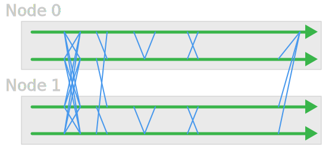

Legion Environment and Batch processing
=======================================

A Simple Serial Job
-------------------

`calculate_pi` - Calculates π by numerically integrating a curve.

\\[\int_{0}^{1}\frac{4}{1+x^2}\text{d}x=\pi\\]


Make a Copy
-----------

```bash
cd ~/Scratch
cp -r /shared/ucl/apps/examples/calculate_pi_dir ./
cd calculate_pi_dir
make
./calculate_pi
```

Job Script
----------

```bash
#!/bin/bash -l
#$ -l h_rt=0:10:00
#$ -cwd
./calculate_pi
```

Job Script Defaults
-------------------

```bash
#$ -l h_rt=0:15:00
#$ -l memory=1G
#$ -l tmpfs=10G
```

Queue Commands
--------------

|:---:|:---|
| `qsub` | submit job |
| `qstat` | view queue status and job info |
| `qdel`  | stop & delete a job |
| `qrsh`  | start an interactive session |


Submitting Jobs to the Queue
----------------------------

```
$ qsub submit.sh
Your job 3521045 ("submit.sh") has been submitted

$ qsub -terse submit.sh
3521045
```

Submitting Jobs to the Queue
----------------------------

Special comments are options for `qsub`

Check `man qsub` for full lists

Every cluster is a little different

Viewing Queue
-------------

```
$ qstat

job-ID  prior   name       user         state submit/start at    
-----------------------------------------------------------------
3521045 0.00000 submit.sh  ccaaxxx      qw    01/14/2014 14:51:54
```

More Detailed Info
------------------

```
qstat -j 3521045
```

(gives a *lot* of output)

Job States
----------

| Letter | Status |
|:--:|:---|
| `q` | queued |
| `w` | waiting |
| `r` | running |
| `E` | error |
| `t` | transferring |
| `h` | held |


Job States - Errors
-------------------

Most common problems:

 * Working directory does not exist
 * Working directory is not in `~/Scratch` (and thus not writable)

Note that `qstat -j` cuts off the end of the error message - try *e.g.* `qexplain 53893` to see full error message.

Removing Jobs
-------------

```
$ qdel 3521045
ccaaxxx has deleted job 3521045
```

* removes a queued job
* stops and removes a running job

Environment Within a Job
------------------------

**Exercise**: Run the simple `calculate_pi` program as a job.

**Exercise**: To see what environment variables are set by the scheduler, try making a job script that runs `env` and puts the output in a file. 

**Exercise**: `sort` the file, and compare it to your current environment to see what has changed. 


Multithreaded Jobs
---------------------


OpenMP
------


Make a Copy
-----------

* Go into your `Scratch` directory
* Make a copy of the `/shared/ucl/apps/examples/openmp_pi_dir` directory
* Build the program using `make`, and try running it


Something Like
--------------

```bash
cd ~/Scratch
cp -r /shared/ucl/apps/examples/openmp_pi_dir ./
cd openmp_pi_dir
make
./openmp_pi
```


Requesting Threads
------------------

```bash
#$ -pe smp 4
```

**Exercise**: Try modifying the script from before to run the new program.

**Exercise**: Run versions with 1, 2, 3, and 4 cores, and compare the timings.

Job Script
----------

```bash
#!/bin/bash -l
#$ -l h_rt=0:10:00
#$ -pe smp 4
#$ -cwd
./openmp_pi
```

Multi-node Jobs
---------------

* Need some method to communicate over the network
* Most common is **MPI**

MPI
-----




Make a Copy
-----------

```bash
cd ~/Scratch
cp -r /shared/ucl/apps/examples/mpi_pi_dir ./
cd mpi_pi_dir
make
./mpi_pi
# This won't always work on clusters
```


Requesting Multinode Jobs
-------------------------

```bash
#$ -pe mpi 36
```

Note that each requested core gets the amount of memory requested.

Job Script
----------

```bash
#!/bin/bash -l
#$ -l h_rt=0:10:00
#$ -pe mpi 4
#$ -cwd

gerun ./mpi_pi
```

**Exercise**: Try modifying the script from before to run the new program, using 1, 2, 4, 8, 12, and 24 cores and the `mpi` parallel environment.

Requesting an Array Job
-----------------------

```bash
#$ -t 3     <- (only runs one job)
#$ -t 1-3
#$ -t 1-7:2
```

This queues an array of jobs which only differ in how the `$SGE_TASK_ID` variable is set.

**Exercise**: Try modifying the serial job script (`calculate_pi`) to run 4 jobs as an array. 

**Exercise**: `calculate_pi` can take an argument to tell it how many steps to use. Try using this with `$SGE_TASK_ID` to run using 300, 500, and 700 steps.


Job Script
----------

```bash
#!/bin/bash -l
#$ -l h_rt=0:10:00
#$ -t 1-4
#$ -cwd

./calculate_pi ${SGE_TASK_ID}0
```


Job Arrays and File Performance
-------------------------------

The Lustre parallel filesystem performs ***worst*** when creating and writing to lots of little files.

Arrays of jobs often create files like this.

To help performance, run this type of job using the local storage on the node, and copy the files over when the job is complete.

**Local Storage**: `$TMPDIR`


Job Script
----------

```bash
#!/bin/bash -l
#$ -l h_rt=0:10:00
#$ -t 1-4
#$ -cwd

cd $TMPDIR
$HOME/my_programs/make_lots_of_files $SGE_TASK_ID
```

Job Script
----------

```
# Then either:
cp * $SGE_WORK_DIR

# or
cp -r $TMPDIR $SGE_WORK_DIR

# or, better for lots of files:
tar -cf $SGE_WORK_DIR/$JOB_NAME.$JOB_ID.$SGE_TASK_ID.tar $TMPDIR
zip -f $SGE_WORK_DIR/$JOB_NAME.$JOB_ID.$SGE_TASK_ID.zip $TMPDIR
```


Existing Applications
---------------------

*Modules* system helps to set up environment for applications.

Check `module avail` to see what modules exist.

    $ module avail
    ------------------ /shared/ucl/apps/modulefiles2/core ------------------
    curl/7.21.3/gnu       gnuplot/4.4.0      mrxvt/0.5.4        sge/6.2u3     
    curl/7.21.3/gnu.4.4.0 gold/2.2.0.5       nedit/5.6          sqlite/3.7.3 
    curl/7.21.3/gnu.4.6.3 grace/5.1.22       rcops/1.0          texlive/2010 
    [...]


Using Modules
-------------

Most modules add one or more programs to your `$PATH`.

    $ htop
    bash: htop: command not found
    $ module load htop
    $ htop

You will see a colourful interactive process viewer.
    
    $ module unload htop
    $ htop
    bash: htop: command not found


Module Contents
---------------

    $ module show htop
    -------------------------------------------------------------------
    /shared/ucl/apps/modulefiles/development/htop/1.0.3/gnu-4.9.2:

    module-whatis    Adds htop 1.0.3 to your environment.
    prereq   gcc-libs/4.9.2
    conflict         htop
    prepend-path     PATH /shared/ucl/apps/htop/1.0.3/gnu-4.9.2/bin 
    prepend-path     MANPATH /shared/ucl/apps/htop/1.0.3/gnu-4.9.2/share/man 
    -------------------------------------------------------------------


Prerequisites and Conflicts
---------------------------

    $ module load plumed/2.2/intel-2015-update2
    plumed/2.2/intel-2015-update2(19):ERROR:151: Module 
     'plumed/2.2/intel-2015-update2' depends on one of the module(s) 
     'openblas/0.2.14/intel-2015-update2'
    plumed/2.2/intel-2015-update2(19):ERROR:102: Tcl command execution failed: 
     prereq openblas/0.2.14/intel-2015-update2

    $ module show plumed/2.2/intel-2015-update2
    -------------------------------------------------------------------
    /shared/ucl/apps/modulefiles/applications/plumed/2.2/intel-2015-update2:

    module-whatis    Adds PLUMED 2.2 to your environment, built using OpenBLAS
    prereq   gcc-libs/4.9.2
    prereq   compilers/intel/2015/update2 
    prereq   mpi/intel/2015/update3/intel
    prereq   openblas/0.2.14/intel-2015-update2
    conflict     plumed
    prepend-path     PATH /shared/ucl/apps/plumed/2.2/intel-2015-update2/openblas/bin/ 
    prepend-path     LD_LIBRARY_PATH /shared/ucl/apps/plumed/2.2/intel-2015-update2/openblas/lib
    prepend-path     LIBRARY_PATH /shared/ucl/apps/plumed/2.2/intel-2015-update2/openblas/lib
    prepend-path     CPATH /shared/ucl/apps/plumed/2.2/intel-2015-update2/openblas/include
    prepend-path     INCLUDE /shared/ucl/apps/plumed/2.2/intel-2015-update2/openblas/include 
    setenv           PLUMED_KERNEL /shared/ucl/apps/plumed/2.2/intel-2015-update2/openblas/lib/libplumedKernel.so
    -------------------------------------------------------------------


Prerequisites Exercise
----------------------

**Exercise**: Successfully load the latest Graphviz module (`graphviz/2.38.0/gnu-4.9.2`).


Recommended Bundles
-------------------

`r/recommended` loads a collection of other modules and then the R module.


Job Script
----------

```bash
#!/bin/bash -l
#$ -l h_rt=0:10:00
#$ -cwd

module unload compilers mpi
module load r/recommended
# Generate a bunch of random numbers
R --no-save --slave <<EOF >r.output.$JOB_ID
runif(50,0,1)
EOF
```


Other Schedulers
----------------

Other systems (e.g. Emerald) may use a slightly different scheduler system, so the scripts can be slightly different -- consult the relevant documentation.

    #$ -pe mpi 24
    #PBS -l nodes=2:ppn=12

    #$ -pe smp 12
    #PBS -l nodes=1:ppn=12

    #$ -l h_rt=1:00:00
    #PBS -l walltime=1:00:00

    #$ -l memory=4G
    #PBS -l mem=4gb


Quick Reference Sheet
----------------------

Legion: [https://wiki.rc.ucl.ac.uk/mediawiki-1.23.9/images/a/ad/Legion_ref_sheet.pdf](https://wiki.rc.ucl.ac.uk/mediawiki-1.23.9/images/a/ad/Legion_ref_sheet.pdf)


