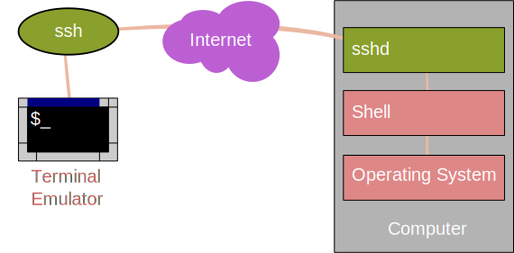
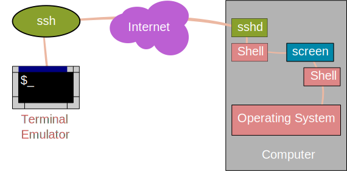
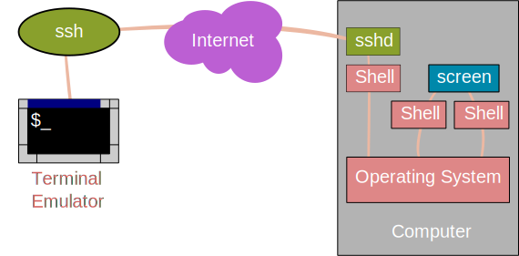
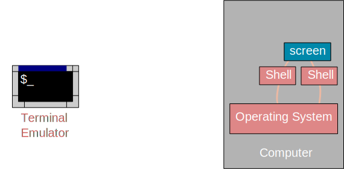

---
title: Extras
slidelink: True
---

GNU Screen
==========

Intro to GNU Screen
-------------------

**Q: What happens if you want to:**

Log out and turn off your PC?

Go home and continue working?

Freely create and delete shell sessions within one terminal?

**A: Use a terminal multiplexer like GNU screen**

First, log into Legion
----------------------

```
ssh user@legion.rc.ucl.ac.uk
```

(or use Putty)



* Take a note of which login node you are assigned!

Then, run "screen"
------------------

```
screen
```

The screen will clear and you will be presented with a new prompt.



Do something in that shell (e.g.) "ls".

Creating new shells in Screen
-----------------------------

* Press **Ctrl-a**, then press **c**

* You'll be given another shell (what screen calls a "window")!


* Create new "windows" with **Ctrl-a, c**

* **Ctrl-a, a** switches between this window and your last one.

* Windows are numbered 0->N, **Ctrl-a, number** (e.g. **Ctrl-a, 3**) to switch to a particular one.


Detaching from your session
---------------------------

* **Ctrl-a, d** detaches from your session.



* **screen -r** re-attaches.

Log out
-------

* You can log out of a machine you have a detached session on and programs will keep running.




Logging back in
---------------

* Then log back in (from anywhere!) and **screen -r** to re-attach.


Logging back in
---------------

* Then log back in (from anywhere!) and **screen -r** to re-attach.


Legion specific
---------------

**NOTE:** make sure you log into the same login node that you started screen on:

* login06: login06.external.legion.ucl.ac.uk

* login07: login07.external.legion.ucl.ac.uk

* login08: login08.external.legion.ucl.ac.uk

* login09: login09.external.legion.ucl.ac.uk

Other screen commands
---------------------

* **screen -d** - forces detach of a screen that's running (so you can screen -r it).  Handy if your SSH connection drops.

* **screen -ax** - forces attach to a screen that's attached to from somewhere else.

* You can configure screen in lots of useful ways, including changing the keyboard shortcuts.  For more see man pages, or online documentation: [(http://www.gnu.org/software/screen/)](http://www.gnu.org/software/screen/)
