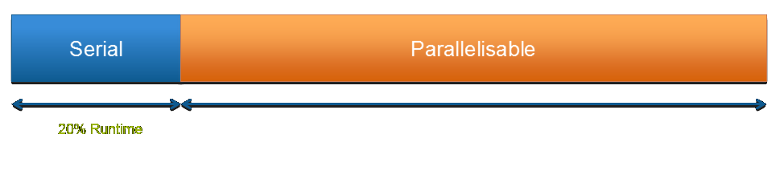
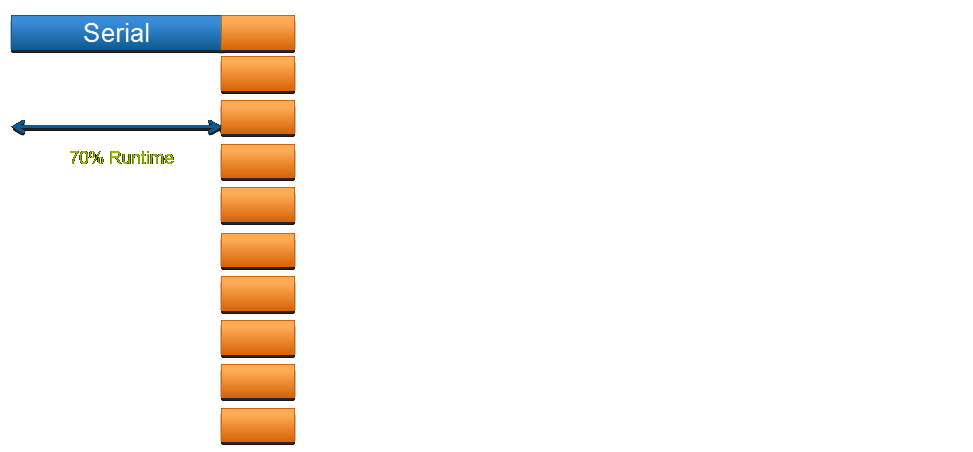

% HPC and HTC using Legion
% Research Computing and Facilitating Services

Overview
========

Objectives
----------

* By the end of this course you should:

    * Understand key concepts around HPC and HTC

    * Be able to plan your work on Legion by:

        + Understanding Legion's hardware architecture

        + Understanding Legion's software stack

        + Writing simple Bash shell scripts

        + Writing job submission scripts to the batch scheduler

    * Be able to effectively use Research Computing services:

        + Learning about Research Computing structure and services

        + Issuing useful and successful support queries

HPC and HTC Concepts
====================

Key Concepts
------------

High Performance Computing (HPC)

High Throughput Computing (HTC)

AKA **"Supercomputing"**

The Computer
------------

Traditional view of a computer is changing
------------------------------------------

* Pressure from *computing requirements*.

* Pressure from *Physics*.

Pressure from computing requirements
------------------------------------

**Example:** Large scale weather simulation

* Detailed description for atmosphere too large to run on today's desktops.

    * Multiple "desktops" are needed to hold all grid data.

    * "Desktops" need to quickly *communicate to synchronise* work over entire grid,

    * Communication between "desktops" can become a bottleneck.

Pressure from computing requirements
------------------------------------

**Example:** Searching database of web-sites for some text (i.e. Google)

* Searching sequentially through large volumes of text too time-consuming.

    * Multiple "desktops" hold different pages.

    * Each "desktop" can report the result of each individual search.

    * **The more "desktops" you add the quicker the search is.**

Pressure from physics
---------------------

* **Serial Process:**

    * A process in which its sub-processes happen sequentially in time.

    * Only one sub-process is active at any given time.

* **Parallel Process:**

    * Process in which a number of stages can occur during the same time interval (e.g. trans-parallel process).

Pressure from physics
---------------------

* **Serial Process:**

    * Speed depends only on the rate at which each sub-process will occur (e.g. processing unit clock speed).

* **Parallel Process:**

    * Speed depends on execution rate of each sub-process *AND* how many sub-processes can be made to occur simultaneously.

**Physics is limiting serial speed**

**Heat α speed³ **

Pressure from physics
---------------------
### All computers today are designed for parallel execution

But...

### Not all computation can be done in parallel!

Amdahl's Law
------------

1 Processor

Amdahl's Law
------------

2 Processors

Amdahl's Law
------------

10 Processors

Amdahl's Law
------------

* Amdahl's law will always be a limiting factor

* Some applications need to be re-written, algorithms re-thought to harness ever more parallel machines.

Amdahl's Law
------------

* If 95% of the program can be parallelized, the theoretical maximum speedup using parallel computing would be 20x, no matter how many processors are used.
