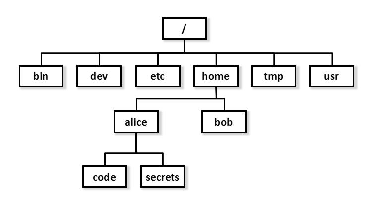
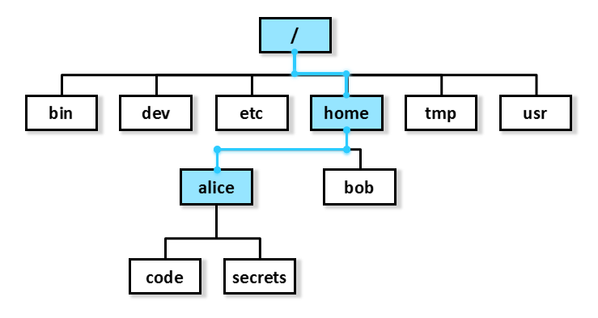
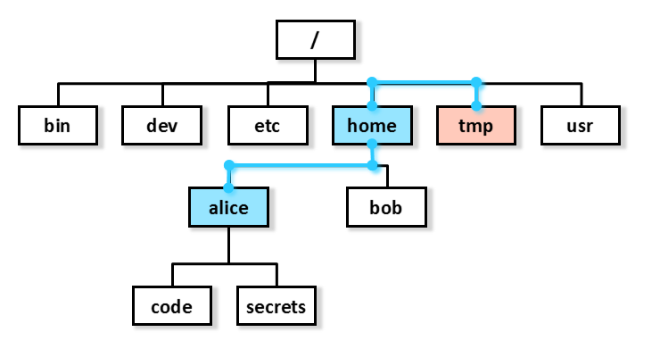
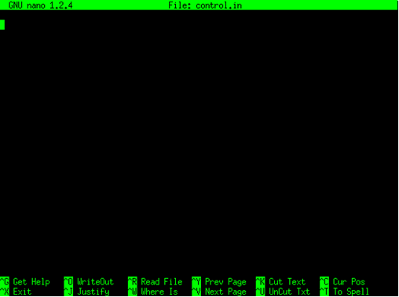
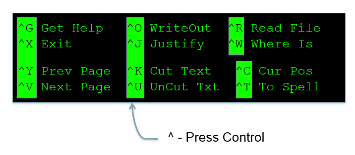

% HPC and HTC using Legion
% Research Computing and Facilitating Services

Introduction to the UNIX shell
==============================

Overview
--------

* Basic interaction with files and directories

    + command line execution

    + Unix directory and file basics

    + file properties

* File manipulation

    + inspecting and editing files

    + searching and filtering

    + archiving and transfer over network

* Scripting and workflows

    + scripting techniques for building workflows


Access to Legion
----------------

* Apply for an account: http://www.ucl.ac.uk/isd/staff/research_services/research-computing/account

* Access is provided through the 4 login nodes connected to the external network:
```
legion.rc.ucl.ac.uk
```

* To access one of the login nodes (remotely) from a Unix machine:
``` 
ssh username@legion.rc.ucl.ac.uk
```

* Log on using UCL username/password

* On Windows (e.g. Desktop@UCL) you can use PuTTY.

Access to Legion
----------------


Access to Legion
----------------


Basic interaction with files and directories
============================================

Command Prompt
--------------

```
[ccaaxxx@login06 ~]$
```

* Has the form **[&lt;username&gt;@&lt;host name&gt; &lt;present directory&gt;]$**

* **&lt;user name&gt;** is the Unix user name (UCL user ID).

* **&lt;host name&gt;** is the name of the computer that you are accessing.

* **&lt;present directory&gt;** is the directory that the user is currently in.

* Commands are typed after the prompt and executed by pressing return.

Command Line Execution
----------------------

```
[ccaaxxx@login06 ~]$ ls
Scratch
[ccaaxxx@login06 ~]$
```

* **ls** lists the contents of the directory
* **~** is the "home directory"

Unix Directory Basics
---------------------

```
[ccaaxxx@login06 ~]$ file ~
/home/ccaaxx: directory
[ccaaxxx@login06 ~]$
```
* **file** identifies the file type
* **~** = /home/ccaaxxx - your *home directory*

Unix Directory Basics
---------------------

```
/home/ccaaxxx: directory

/home: directory

/: directory
```

* **/home/ccaaxxxx** - the *full path* to the home directory

Hidden files and directories
----------------------------

```
[ccaaxxx@login06 ~]$ ls -a
.  ..  .bash_history  .bash_logout
.bash_profile  .bashrc  .cshrc  .emacs
Scratch  .ssh
[ccaaxxx@login06 ~]$ 
```

* Files starting with "." are hidden

* **.** - Present working directory (in this case ~)
* **..** - Directory above (in this case /home)

Everything is a file
--------------------

```
[ccaaxxx@login06 ~]$ file .* *
.:             directory
..:            directory
.bash_history: ASCII text
.bash_logout:  ASCII English text
.bash_profile: ASCII English text
.bashrc:       Bourne-Again shell script text executable
.cshrc:        C shell script text executable
.emacs:        Lisp/Scheme program text (Emacs editor)
.ssh:          directory (for secure shell)
Scratch:       symbolic link to `/scratch/scratch/ccaaxxx'
```

* "*" - All visible files
* ".*" - All invisible files

Everything is a file
--------------------

Just to make the point:
```
[ccaaxxx@login06 ~]$ which ls
 /bin/ls

[ccaaxxx@login06 ~]$ file /bin/ls
/bin/ls: ELF 64-bit LSB executable, AMD x86-64, version 1 (SYSV), for GNU/Linux 2.4.0, 
dynamically linked (uses shared libs), stripped
```

* /bin/ls is an executable file (!)
* **which** - shows the path to the argument, in this case ls

Directory Navigation
--------------------

```
[ccaaxxx@login06 ~]$ pwd
/home/ccaaxxx

[ccaaxxx@login06 ~]$ cd /
[ccaaxxx@login06 /]$ 
```

* **cd** - change directory
* **pwd** - full path to present working directory
* **/** - the "root" directory

Exercise:
--------

explore the / directory using ls, cd, ., .., pwd

* If you feel lost, just execute **"cd"** with no arguments (or **"cd ~"**) and you will be returned to your home directory.

* **"cd -"** - will return you to the previous directory you were in.

Filesystem structure
--------------------



Absolute path
-------------



/home/alice

Relative path
-------------



../home/alice


Directory creation
------------------

```
[ccaaxxx@login06 ~]$ mkdir a_directory

[ccaaxxx@login06 ~]$ ls
a_directory Scratch
```

* **mkdir** - create a directory


Directory creation
------------------

```
[ccaaxxx@login06 ~]$ mkdir -p a_directory/inside/the_other
[ccaaxxx@login06 ~]$ cd a_directory/inside/the_other
[ccaaxxx@login06 the_other]$ pwd
/home/ccaaxxx/a_directory/inside/the_other
```

* **mkdir -p** - creates consecutive sub-directories

Touching a file
---------------

```
[ccaaxxx@login06 ~]$ touch a_file
[ccaaxxx@login06 ~]$ ls
a_directory a_file Scratch
```

* **touch** - create or update the date of a file
* This is **not** usually how files are created

Copying files
-------------

```
[ccaaxxx@login06 ~]$ cp a_file copy_of_a_file
[ccaaxxx@login06 ~]$ ls
a_directory a_file copy_of_a_file Scratch
```

* **cp** copy a file (or a directory tree)

Exercise:
--------

Create and copy a directory tree.  Use the command **"man cp**" for more information

File manipulation
=================


Editing files
-------------

```
[ccaaxxx@login06 ~]$ nano a_file
```



* **nano** - simple file editor


Nano
----



* **nano** - simple file editor
* Commands are along the botton of editor screen
* ^ - shorthand for control key

Editors
-------

There are many other (better but more complex) text file editors on the system such as **vim**, **emacs** and **nedit**.

Use the one you feel most comfortable with (if you don't know any, use nano (or nedit if you have X-Windows)).

Moving/Renaming files and directories
-------------------------------------

```
[ccaaxxx@login06 ~]$ mv a_file control.in
[ccaaxxx@login06 ~]$ ls
a_directory control.in Scratch

[ccaaxxx@login06 ~]$ mv control.in a_directory

[ccaaxxx@login06 ~]$ ls a_directory
control.in inside
```

* **mv** - rename or move a file/directory

Deleting files and directories
------------------------------

```
[ccaaxxx@login06 ~]$ rm a_directory/control.in

[ccaaxxx@login06 ~]$ rm a_directory
rm: cannot remove `a_directory/': Is a directory

[ccaaxxx@login06 ~]$ rm -r a_directory
[ccaaxxx@login06 ~]$ 
```

* **rm** - delete a file
* **rm -r** 0 delete a directory and all its contents
* **rm operations are irreversible!!!**
* The -i argument is highly recommended

Exercise:
--------

In ~/Scratch...
 
* Create the following directory tree:
```
    work
    work/input_data
    work/results
    work/program
```

* Create the file "input.txt" with some random lines in it.

* Move the file to input_data and rename it in the same command to control01.txt

* Create the directory tree in one line only: experiment/results/report

* Delete all directory trees created in one single command without explicit reference to any of the directory and file names.

File properties
---------------

```
[ccaaxxx@login06 ~]$ ls -l
total 8
drwxr-xr-x 2 ccaaxxx rcops 4096 2009-12-08 07:31 a_directory
-rw-r--r-- 1 ccaaxxx rcops    0 2009-12-08 07:31 a_file
drwxr-xr-x 2 ccaaxxx rcops 4096 2009-12-08 06:50 Scratch

```

* **ls -l** - list file properties (details)

File properties
---------------

```
drwxr-xr-x 2 ccaaxxx rcops 4096 2009-12-08 07:31 a_directory

        drwxr-xr-x      - File type and permissions
        2		- Number of links to the file
        ccaaxxx         - User name of file owner
        rcops           - Group to which the file belongs 
        4096            - size of file in bytes
        2009-12-08      - last change data
        07:31           - last change time
        a_directory     - file name
```


* **ls -l** - list file properties (details)

File permissions
----------------

* There are three user security classifications that apply to the ownership of a file:

    + **user:** the individual user that has ownership of the file

    + **group:** a group of users to which that user belongs

    + **others:** all other users (not owner or in that group)

* Each of these has three file access classifications:

    + **read:** permission to read the file

    + **write:** permission to write the file

    + **execute:** permission to execute (run) the file

File permissions
----------------

**drwxr-xrx** has four fields:

|:-----|:----------------------------------------------|
| d    | - the file is a directory                     |
| rwx  | - the user has read, write and execute access |
| r-x  | - the group has read and execute access       |
| r-x  | - others have read and execute access         |


| Permissions | read | write | execute |
|:------------|:----:|:-----:|:-------:|
| rwx         | yes  | yes   | yes     |
| rw-         | yes  | yes   | no      |
| r--         | yes  | no    | no      |
| r-x         | yes  | no    | yes     |
| ---         | no   | no    | no      |

File permissions
----------------

```
[ccaaxxx@login06 ~]$ ls -l 
...
drwxr-xr-x 2 ccaaxxx rcops 4096 2009-12-08 07:31 a_directory
...

[ccaaxxx@login06 ~]$ chmod go-rx a_directory

[ccaaxxx@login06 ~]$ ls -l 
...
drwx------ 2 ccaaxxx rcops 4096 2009-12-08 07:31 a_directory
```

* **chmod** - change the permissions of a file

File permissions
----------------

How did the permissions definition go-rx work?

```
chmod [ugoa][+/-][rwx] file
```

* ugoa - user, group, other, all

* +/- - add/remove

* rwx - read, write, execute

If you don't specify u,g,o or a, default is **ALL** (so chmod +x makes file executable for everyone).

* **chmod** - change the permissions of a file

Exercise:
--------

* Change the permission of a full directory tree with one single **chmod** command (look in the man pages for more information).

* When typing the command " ls /sh", press the tab key after typing "/sh".  What happens?

Inspecting files
----------------

```
[ccaaxxx@login06 ~]$ cd /shared/ucl/apps/examples/openmp_pi_dir
[ccaaxxx@login06 examples]$ less openmp_pi.f90
```

* **less** - visualise a text file:
    + use arrow keys
    + page up/page down
    + search by typing "/"
    + quit by typing "q"

Other file inspection tools
---------------------------

|:-------|:----------------------------------------------------------------------|
|head    |- visualise the first 10 lines of a file                               |
|tail    |- visualise the last 10 lines of a file                                |
|cat     |- concatenate files provided as input and dump the result to *stdout*  |
|sdiff   |- visualise and compare two files side-by-side                         |

(Use "man &lt;tool&gt;" to see more information)


Filtering directory listings
----------------------------

```
[cccaaxxx@login06 ~]$ ls /shared/ucl/apps/BLAST/install | grep blast
blastall
blast-nr-1.out
blast-pdb-1.out
```

* **grep** - prints lines containing a string.  Also searches for strings in text files.

Searching for strings in files
------------------------------

```
[cccaaxxx@login06 ~]$ grep SWAP /shared/ucl/apps/BLAST/install/test.faa
SWGEGCGLLHNYGVYTKVSRYLDWIHGHIRDKEAPQKSWAP
```

* **grep** - prints lines containing a string.  Also searches for strings in text files.

Archiving and compression
-------------------------

```
[ccaaxxx@login06 Scratch]$ tar -zcvf work.tgz work
work/
work/program/
work/calculations/
work/calculations/control.in
work/workfile

[ccaaxxx@login06 Scratch]$ ls
work.tgz work
```

* **tar -zcvf** - archives and compresses directory trees and files 
    + **c** - create archive 
    + **z** - compress
    + **v** - verbose
    + **f** - in the following file

Extracting files from a compressed archive
------------------------------------------

```
[ccaaxxx@login06 Scratch]$ ls
work.tgz
[ccaaxxx@login06 Scratch]$ tar -zxvf work.tgz 
work/
work/program/
work/calculations/
work/calculations/control.in
work/workfile
[ccaaxxx@login06 Scratch]$ ls
work.tgz work
```

* **tar -z*x*vf** - extracts and uncompresses directory trees and files 
    + **x** - extract archive 
    + **z** - uncompress
    + **v** - verbose
    + **f** - from the following file

Transferring files across a network
-----------------------------------

From Legion:

```
[ccaaxxx@login06 Scratch]$ scp work.tgz ccaaxxx@socrates.ucl.ac.uk:~/
...
Password:
work.tgz         100%  340     0.3KB/s   00:00

```

To Legion:

```
[ccaaxxx@login06 Scratch]$ scp ccaaxxx@socrates.ucl.ac.uk:~/work.tgz .
...
Password:
work.tgz         100%  340     0.3KB/s   00:00

```

Note: remote machine (in this case Socrates) must be running SSH server. So, from your destop: 

```
[you@desktop ~]$ scp work.tgz ccaaxxx@login05.external.legion.ucl.ac.uk:Scratch
[you@desktop ~]$ scp ccaaxxx@login05.external.legion.ucl.ac.uk:Scratch/work.tgz .
```

* **scp** - securely copy files across a network 

