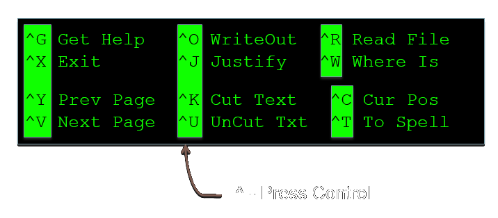

% HPC and HTC using Legion
% Research Computing and Facilitating Services

Introduction to the UNIX shell
==============================

Overview
--------

* Basic interaction with files and directories

    + command line execution

    + Unix directory and file basics

    + file properties

* File manipulation

    + inspecting and editing files

    + searching and filtering

    + archiving and transfer over network

* Scripting and workflows

    + scripting techniques for building workflows


Access to Legion
----------------

* Apply for an account: http://www.ucl.ac.uk/isd/staff/research_services/research-computing/account

* Access is provided through the 4 login nodes connected to the external network:
```
legion.rc.ucl.ac.uk
```

* To access one of the login nodes (remotely) from a Unix machine:
``` 
ssh username@legion.rc.ucl.ac.uk
```

* Log on using UCL username/password

* On Windows (e.g. Desktop@UCL) you can use PuTTY.

Access to Legion
----------------


Access to Legion
----------------


Basic interaction with files and directories
============================================

Command Prompt
--------------

```
[ccaaxxx@login06 ~]$
```

* Has the form **[&lt;username&gt;@&lt;host name&gt; &lt;present directory&gt;]$**

* **&lt;user name&gt;** is the Unix user name (UCL user ID).

* **&lt;host name&gt;** is the name of the computer that you are accessing.

* **&lt;present directory&gt;** is the directory that the user is currently in.

* Commands are typed after the prompt and executed by pressing return.

Command Line Execution
----------------------

```
[ccaaxxx@login06 ~]$ ls
Scratch
[ccaaxxx@login06 ~]$
```

* **ls** lists the contents of the directory
* **~** is the "home directory"

Unix Directory Basics
---------------------

```
[ccaaxxx@login06 ~]$ file ~
/home/ccaaxx: directory
[ccaaxxx@login06 ~]$
```
* **file** identifies the file type
* **~** = /home/ccaaxxx - your *home directory*

Unix Directory Basics
---------------------

```
/home/ccaaxxx: directory

/home: directory

/: directory
```

* **/home/ccaaxxxx** - the *full path* to the home directory

Hidden files and directories
----------------------------

```
[ccaaxxx@login06 ~]$ ls -a
.  ..  .bash_history  .bash_logout
.bash_profile  .bashrc  .cshrc  .emacs
Scratch  .ssh
[ccaaxxx@login06 ~]$ 
```

* Files starting with "." are hidden

* **.** - Present working directory (in this case ~)
* **..** - Directory above (in this case /home)

Everything is a file
--------------------

```
[ccaaxxx@login06 ~]$ file .* *
.:             directory
..:            directory
.bash_history: ASCII text
.bash_logout:  ASCII English text
.bash_profile: ASCII English text
.bashrc:       Bourne-Again shell script text executable
.cshrc:        C shell script text executable
.emacs:        Lisp/Scheme program text (Emacs editor)
.ssh:          directory (for secure shell)
Scratch:       symbolic link to `/scratch/scratch/ccaaxxx'
```

* "*" - All visible files
* ".*" - All invisible files

Everything is a file
--------------------

Just to make the point:
```
[ccaaxxx@login06 ~]$ which ls
 /bin/ls

[ccaaxxx@login06 ~]$ file /bin/ls
/bin/ls: ELF 64-bit LSB executable, AMD x86-64, version 1 (SYSV), for GNU/Linux 2.4.0, 
dynamically linked (uses shared libs), stripped
```

* /bin/ls is an executable file (!)
* **which** - shows the path to the argument, in this case ls

Directory Navigation
--------------------

```
[ccaaxxx@login06 ~]$ pwd
/home/ccaaxxx

[ccaaxxx@login06 ~]$ cd /
[ccaaxxx@login06 /]$ 
```

* **cd** - change directory
* **pwd** - full path to present working directory
* **/** - the "root" directory

Exercise:
--------

explore the / directory using ls, cd, ., .., pwd

* If you feel lost, just execute **"cd"** with no arguments (or **"cd ~"**) and you will be returned to your home directory.

* **"cd -"** - will return you to the previous directory you were in.

Filesystem structure
--------------------


Absolute path
-------------


/home/alice

Relative path
-------------


../home/alice


Directory creation
------------------

```
[ccaaxxx@login06 ~]$ mkdir a_directory

[ccaaxxx@login06 ~]$ ls
a_directory Scratch
```

* **mkdir** - create a directory


Directory creation
------------------

```
[ccaaxxx@login06 ~]$ mkdir -p a_directory/inside/the_other
[ccaaxxx@login06 ~]$ cd a_directory/inside/the_other
[ccaaxxx@login06 the_other]$ pwd
/home/ccaaxxx/a_directory/inside/the_other
```

* **mkdir -p** - creates consecutive sub-directories

Touching a file
---------------

```
[ccaaxxx@login06 ~]$ touch a_file
[ccaaxxx@login06 ~]$ ls
a_directory a_file Scratch
```

* **touch** - create or update the date of a file
* This is **not** usually how files are created

Copying files
-------------

```
[ccaaxxx@login06 ~]$ cp a_file copy_of_a_file
[ccaaxxx@login06 ~]$ ls
a_directory a_file copy_of_a_file Scratch
```

* **cp** copy a file (or a directory tree)

Exercise:
--------

Create and copy a directory tree.  Use the command **"man cp**" for more information

Editing files
-------------

```
[ccaaxxx@login06 ~]$ nano a_file
```


* **nano** - simple file editor


Nano
----



* **nano** - simple file editor
* Commands are along the botton of editor screen
* ^ - shorthand for control key

Editors
-------

There are many other (better but more complex) text file editors on the system such as **vim**, **emacs** and **nedit**.

Use the one you feel most comfortable with (if you don't know any, use nano (or nedit if you have X-Windows)).

Moving/Renaming Files and Directories
-------------------------------------

```
[ccaaxxx@login06 ~]$ mv a_file control.in
[ccaaxxx@login06 ~]$ ls
a_directory control.in Scratch

[ccaaxxx@login06 ~]$ mv control.in a_directory

[ccaaxxx@login06 ~]$ ls a_directory
control.in inside
```

* **mv** - rename or move a file/directory


