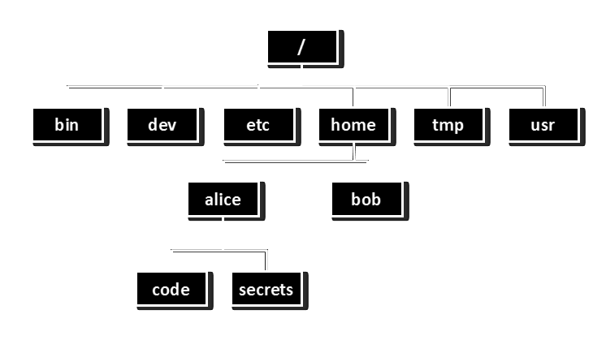
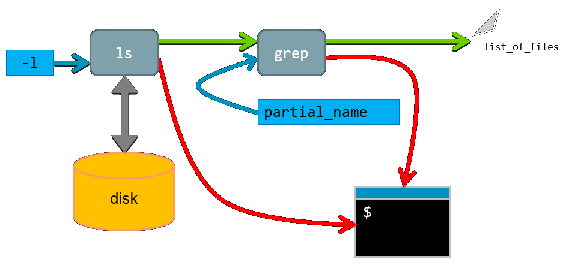

% HPC and HTC using Legion
% Research Computing and Facilitating Services

Introduction to the UNIX shell
==============================

Overview
--------

* Basic interaction with files and directories

    + command line execution

    + Unix directory and file basics

    + file properties

* File manipulation

    + inspecting and editing files

    + searching and filtering

    + archiving and transfer over network

* Scripting and workflows

    + scripting techniques for building workflows


Access to Legion
----------------

* Apply for an account: http://www.ucl.ac.uk/isd/staff/research_services/research-computing/account

* Access is provided through the 4 login nodes connected to the external network:
```
legion.rc.ucl.ac.uk
```

* To access one of the login nodes (remotely) from a Unix machine:
``` 
ssh username@legion.rc.ucl.ac.uk
```

* Log on using UCL username/password

* On Windows (e.g. Desktop@UCL) you can use PuTTY.

Access to Legion
----------------


Access to Legion
----------------


Basic interaction with files and directories
============================================

Command Prompt
--------------

```
[ccaaxxx@login06 ~]$
```

* Has the form **[&lt;username&gt;@&lt;host name&gt; &lt;present directory&gt;]$**

* **&lt;user name&gt;** is the Unix user name (UCL user ID).

* **&lt;host name&gt;** is the name of the computer that you are accessing.

* **&lt;present directory&gt;** is the directory that the user is currently in.

* Commands are typed after the prompt and executed by pressing return.

Command Line Execution
----------------------

```
[ccaaxxx@login06 ~]$ ls
Scratch
[ccaaxxx@login06 ~]$
```

* **ls** lists the contents of the directory
* **~** is the "home directory"

Unix Directory Basics
---------------------

```
[ccaaxxx@login06 ~]$ file ~
/home/ccaaxx: directory
[ccaaxxx@login06 ~]$
```
* **file** identifies the file type
* **~** = /home/ccaaxxx - your *home directory*

Unix Directory Basics
---------------------

```
/home/ccaaxxx: directory

/home: directory

/: directory
```

* **/home/ccaaxxxx** - the *full path* to the home directory

Hidden files and directories
----------------------------

```
[ccaaxxx@login06 ~]$ ls -a
.  ..  .bash_history  .bash_logout
.bash_profile  .bashrc  .cshrc  .emacs
Scratch  .ssh
[ccaaxxx@login06 ~]$ 
```

* Files starting with "." are hidden

* **.** - Present working directory (in this case ~)
* **..** - Directory above (in this case /home)

Everything is a file
--------------------

```
[ccaaxxx@login06 ~]$ file .* *
.:             directory
..:            directory
.bash_history: ASCII text
.bash_logout:  ASCII English text
.bash_profile: ASCII English text
.bashrc:       Bourne-Again shell script text executable
.cshrc:        C shell script text executable
.emacs:        Lisp/Scheme program text (Emacs editor)
.ssh:          directory (for secure shell)
Scratch:       symbolic link to `/scratch/scratch/ccaaxxx'
```

* "*" - All visible files
* ".*" - All invisible files

Everything is a file
--------------------

Just to make the point:
```
[ccaaxxx@login06 ~]$ which ls
 /bin/ls

[ccaaxxx@login06 ~]$ file /bin/ls
/bin/ls: ELF 64-bit LSB executable, AMD x86-64, version 1 (SYSV), for GNU/Linux 2.4.0, 
dynamically linked (uses shared libs), stripped
```

* /bin/ls is an executable file (!)
* **which** - shows the path to the argument, in this case ls

Directory Navigation
--------------------

```
[ccaaxxx@login06 ~]$ pwd
/home/ccaaxxx

[ccaaxxx@login06 ~]$ cd /
[ccaaxxx@login06 /]$ 
```

* **cd** - change directory
* **pwd** - full path to present working directory
* **/** - the "root" directory

Exercise:
--------

explore the / directory using ls, cd, ., .., pwd

* If you feel lost, just execute **"cd"** with no arguments (or **"cd ~"**) and you will be returned to your home directory.

* **"cd -"** - will return you to the previous directory you were in.

Filesystem structure
--------------------



Absolute path
-------------


/home/alice

Relative path
-------------


../home/alice


Directory creation
------------------

```
[ccaaxxx@login06 ~]$ mkdir a_directory

[ccaaxxx@login06 ~]$ ls
a_directory Scratch
```

* **mkdir** - create a directory


Directory creation
------------------

```
[ccaaxxx@login06 ~]$ mkdir -p a_directory/inside/the_other
[ccaaxxx@login06 ~]$ cd a_directory/inside/the_other
[ccaaxxx@login06 the_other]$ pwd
/home/ccaaxxx/a_directory/inside/the_other
```

* **mkdir -p** - creates consecutive sub-directories

Touching a file
---------------

```
[ccaaxxx@login06 ~]$ touch a_file
[ccaaxxx@login06 ~]$ ls
a_directory a_file Scratch
```

* **touch** - create or update the date of a file
* This is **not** usually how files are created

Copying files
-------------

```
[ccaaxxx@login06 ~]$ cp a_file copy_of_a_file
[ccaaxxx@login06 ~]$ ls
a_directory a_file copy_of_a_file Scratch
```

* **cp** copy a file (or a directory tree)

Exercise:
--------

Create and copy a directory tree.  Use the command **"man cp**" for more information

File manipulation
=================


Editing files
-------------

```
[ccaaxxx@login06 ~]$ nano a_file
```


* **nano** - simple file editor


Nano
----


* **nano** - simple file editor
* Commands are along the botton of editor screen
* ^ - shorthand for control key

Editors
-------

There are many other (better but more complex) text file editors on the system such as **vim**, **emacs** and **nedit**.

Use the one you feel most comfortable with (if you don't know any, use nano (or nedit if you have X-Windows)).

Moving/Renaming files and directories
-------------------------------------

```
[ccaaxxx@login06 ~]$ mv a_file control.in
[ccaaxxx@login06 ~]$ ls
a_directory control.in Scratch

[ccaaxxx@login06 ~]$ mv control.in a_directory

[ccaaxxx@login06 ~]$ ls a_directory
control.in inside
```

* **mv** - rename or move a file/directory

Deleting files and directories
------------------------------

```
[ccaaxxx@login06 ~]$ rm a_directory/control.in

[ccaaxxx@login06 ~]$ rm a_directory
rm: cannot remove `a_directory/': Is a directory

[ccaaxxx@login06 ~]$ rm -r a_directory
[ccaaxxx@login06 ~]$ 
```

* **rm** - delete a file
* **rm -r** - delete a directory and all its contents
* **rm operations are irreversible!!!**
* The -i argument is highly recommended

Exercise:
--------

In ~/Scratch...
 
* Create the following directory tree:
```
    work
    work/input_data
    work/results
    work/program
```

* Create the file "input.txt" with some random lines in it.

* Move the file to input_data and rename it in the same command to control01.txt

* Create the directory tree in one line only: experiment/results/report

* Delete all directory trees created in one single command without explicit reference to any of the directory and file names.

File properties
---------------

```
[ccaaxxx@login06 ~]$ ls -l
total 8
drwxr-xr-x 2 ccaaxxx rcops 4096 2009-12-08 07:31 a_directory
-rw-r--r-- 1 ccaaxxx rcops    0 2009-12-08 07:31 a_file
drwxr-xr-x 2 ccaaxxx rcops 4096 2009-12-08 06:50 Scratch

```

* **ls -l** - list file properties (details)

File properties
---------------

```
drwxr-xr-x 2 ccaaxxx rcops 4096 2009-12-08 07:31 a_directory

        drwxr-xr-x      - File type and permissions
        2		- Number of links to the file
        ccaaxxx         - User name of file owner
        rcops           - Group to which the file belongs 
        4096            - size of file in bytes
        2009-12-08      - last change data
        07:31           - last change time
        a_directory     - file name
```


* **ls -l** - list file properties (details)

File permissions
----------------

* There are three user security classifications that apply to the ownership of a file:

    + **user:** the individual user that has ownership of the file

    + **group:** a group of users to which that user belongs

    + **others:** all other users (not owner or in that group)

* Each of these has three file access classifications:

    + **read:** permission to read the file

    + **write:** permission to write the file

    + **execute:** permission to execute (run) the file

File permissions
----------------

**drwxr-xrx** has four fields:

|:-----|:----------------------------------------------|
| d    | - the file is a directory                     |
| rwx  | - the user has read, write and execute access |
| r-x  | - the group has read and execute access       |
| r-x  | - others have read and execute access         |


| Permissions | read | write | execute |
|:------------|:----:|:-----:|:-------:|
| rwx         | yes  | yes   | yes     |
| rw-         | yes  | yes   | no      |
| r--         | yes  | no    | no      |
| r-x         | yes  | no    | yes     |
| ---         | no   | no    | no      |

File permissions
----------------

```
[ccaaxxx@login06 ~]$ ls -l 
...
drwxr-xr-x 2 ccaaxxx rcops 4096 2009-12-08 07:31 a_directory
...

[ccaaxxx@login06 ~]$ chmod go-rx a_directory

[ccaaxxx@login06 ~]$ ls -l 
...
drwx------ 2 ccaaxxx rcops 4096 2009-12-08 07:31 a_directory
```

* **chmod** - change the permissions of a file

File permissions
----------------

How did the permissions definition go-rx work?

```
chmod [ugoa][+/-][rwx] file
```

* ugoa - user, group, other, all

* +/- - add/remove

* rwx - read, write, execute

If you don't specify u,g,o or a, default is **ALL** (so chmod +x makes file executable for everyone).

* **chmod** - change the permissions of a file

Exercise:
--------

* Change the permission of a full directory tree with one single **chmod** command (look in the man pages for more information).

* When typing the command " ls /sh", press the tab key after typing "/sh".  What happens?

Inspecting files
----------------

```
[ccaaxxx@login06 ~]$ cd /shared/ucl/apps/examples/openmp_pi_dir
[ccaaxxx@login06 examples]$ less openmp_pi.f90
```

* **less** - visualise a text file:
    + use arrow keys
    + page up/page down
    + search by typing "/"
    + quit by typing "q"

Other file inspection tools
---------------------------

|:-------|:----------------------------------------------------------------------|
|head    |- visualise the first 10 lines of a file                               |
|tail    |- visualise the last 10 lines of a file                                |
|cat     |- concatenate files provided as input and dump the result to *stdout*  |
|sdiff   |- visualise and compare two files side-by-side                         |

(Use "man &lt;tool&gt;" to see more information)


Filtering directory listings
----------------------------

```
[cccaaxxx@login06 ~]$ ls /shared/ucl/apps/BLAST/install | grep blast
blastall
blast-nr-1.out
blast-pdb-1.out
```

* **grep** - prints lines containing a string.  Also searches for strings in text files.

Searching for strings in files
------------------------------

```
[cccaaxxx@login06 ~]$ grep SWAP /shared/ucl/apps/BLAST/install/test.faa
SWGEGCGLLHNYGVYTKVSRYLDWIHGHIRDKEAPQKSWAP
```

* **grep** - prints lines containing a string.  Also searches for strings in text files.

Links
-----

* Created with "ln"

* Two types:
    + "Hard" - indistinguishable from files
    + "Soft" (or "Symbolic") - like a shortcut

Hard links
----------

* Inode table keeps track of hard links

* Deleting a file = "unlinking" it

* Can only be used inside a single file system

Soft links
----------

* Shortcut, e.g.

```
[cccaaxxx@login06 ~]$ ln -s ~/some_project/2012/part531 ~/current_project
[cccaaxxx@login06 ~]$ ls -l ~ 
lrwxr-xr-x  1 ccaaxxx  staff  11 10 Oct 17:56
               current_project -> /home/ccaaxxx/some_project_2012/part531
```

Soft links
----------

* Can use relative or absolute paths!

* Create using absolute paths to make sure they go where you want

* "Scratch" in your home directory is a soft link
    + Makes it easier to access your scratch area

Archiving and compression
-------------------------

```
[ccaaxxx@login06 Scratch]$ tar -zcvf work.tgz work
work/
work/program/
work/calculations/
work/calculations/control.in
work/workfile

[ccaaxxx@login06 Scratch]$ ls
work.tgz work
```

* **tar -zcvf** - archives and compresses directory trees and files 
    + **c** - create archive 
    + **z** - compress
    + **v** - verbose
    + **f** - in the following file

Extracting files from a compressed archive
------------------------------------------

```
[ccaaxxx@login06 Scratch]$ ls
work.tgz
[ccaaxxx@login06 Scratch]$ tar -zxvf work.tgz 
work/
work/program/
work/calculations/
work/calculations/control.in
work/workfile
[ccaaxxx@login06 Scratch]$ ls
work.tgz work
```

* **tar -z*x*vf** - extracts and uncompresses directory trees and files 
    + **x** - extract archive 
    + **z** - uncompress
    + **v** - verbose
    + **f** - from the following file

Transferring files across a network
-----------------------------------

From Legion:

```
[ccaaxxx@login06 Scratch]$ scp work.tgz ccaaxxx@socrates.ucl.ac.uk:~/
...
Password:
work.tgz         100%  340     0.3KB/s   00:00

```

To Legion:

```
[ccaaxxx@login06 Scratch]$ scp ccaaxxx@socrates.ucl.ac.uk:~/work.tgz .
...
Password:
work.tgz         100%  340     0.3KB/s   00:00

```

Note: remote machine (in this case Socrates) must be running SSH server. So, from your destop: 

```
[you@desktop ~]$ scp work.tgz ccaaxxx@login05.external.legion.ucl.ac.uk:Scratch
[you@desktop ~]$ scp ccaaxxx@login05.external.legion.ucl.ac.uk:Scratch/work.tgz .
```

* **scp** - securely copy files across a network 

Scripting and workflows
=======================

Output redirection and piping
-----------------------------

* Two very important concepts:

    + Standard Output (stdout) - default destination of a program's output.  It is generally the terminal screen.

    + Standard Input (stdin) - default source of a program's input.  It is generally the command line.


Output redirection and piping
-----------------------------

```
[ccaaxxx@login06 ~]$ ls /home > ls_home.txt
```

* **&gt;** - redirect stdout to a file


```
[ccaaxxx@login06 ~]$ ls /home | less
```

* **|** "pipe" stdout to stdin of a command


Output redirection and piping
-----------------------------


Output redirection and piping
-----------------------------


Output redirection and piping
-----------------------------

ls -l


Output redirection and piping
-----------------------------

ls -l > list_of_files


Output redirection and piping
-----------------------------

ls -l | grep partial_name > list_of_files



Output redirection and piping
-----------------------------

You can chain any number of programs together to achieve your goal:


This allows you to build up fairly complex workflows within one command-line.

Shell scripting
---------------

```
#!/bin/bash
# This is a very simple hello world script.
echo "Hello, world!"
```

* \#! - tells the shell that it should use /bin/bash as the interpreter
* \# - a comment (ignored by /bin/bash)
* echo - a command that prints arguments to stdout

Exercise:
--------

* Create a "Hello world"-like script using command line tools and execute it.

* Copy and alter your script to redirect output to a file using &gt;.

* Alter your script to use &gt;&gt; instead of &gt;.  What effect does this have on its behaviour?

Exercise Solutions:
------------------

"." not present in the environment variable $PATH:

```
[ccaaxxx@login06 ~]$ hello_world.sh
bash: hello_world.sh: command not found
```

File permissions not set to executable by user:

```
[ccaaxxx@login06 ~]$ ./hello_world.sh
bash: ./hello_world.sh: Permission denied
```

using ./ and chmod 755:

```
[ccaaxxx@login06 ~]$ ./hello_world.sh
Hello World!
```

Exercise:
--------

* Use '**seq** 1 75 \> numbers.txt' to 
generate a file containing a list of 
numbers. Use the **head**, **tail**, and **less** 
commands to look at it, then use grep to
search it for a number.

* Use a combination of head and tail to get an exact line number

Environment Variables
----------------------

```
[ccaaxxx@login06 ~]$ variable='string'
[ccaaxxx@login06 ~]$ variable=$other_variable
```

* Defined and used within a shell script only.

* No spaces around the assignment symbol "=".

* $ means "the value assigned to the following variable". 

Global Environment Variables
----------------------------

* defined within a shell and also in scripts called from the shell

```
[ccaaxxx@login06 ~]$ export ENV_VARIABLE='value'
```

Exercise
--------

* Using two nested scripts, show that the value of an exported variable in the environment where you launch the scripts, propagates all the way down to the second script. 

Updated process diagram
-----------------------


Special environment variables
-----------------------------

What is the output of this command?

```
[ccaaxxx@login06 ~]$ echo $PATH
``` 

Note the structure: \<path1\>:\<path2\>:\<path3\>  

PATH is an environmental variable which Bash uses to search for commands typed on the command line without a full path. 

**Exercise:** Use the command **env** to discover more.

Variables in shell scripts
--------------------------

```
#!/bin/bash
# This is a very simple hello world script
message='Hello World!'
echo $message
echo ${message}
```

|:---------|:---------------------------------------------------------|
| #!       | tells the shell that this the interpreter (/bin/bash)    |
| #        | followed by a blank character is a comment line          |
| message  | variable to which the string 'Hello World!' is assigned  |
| echo     | prints to screen the contents of the variable "$message" |


Command line arguments
----------------------

Variables can also be defined through the command line

```
[ccaaxxx@login06 ~]$ ./script.sh arg another
```

Within the script:
$1 contains "arg"
$2 contains "another"

**Exercise:** Using $1 and $2, write a script that print both variables to the screen.


Storing output of commands in variables 
---------------------------------------

Run commands inside **$( )** and assign the wrapped command to a variable

```
[ccaaxxx@login06 ~]$ ls 
a_directory  a_file  Scratch 
[ccaaxxx@login06 ~]$ dir_contents=$( ls ) 
[ccaaxxx@login06 ~]$ echo $dir_contents 
a_directory a_file Scratch
```

Basic arithmetic
----------------

```
[ccaaxxx@login06 ~]$ two=2 
[ccaaxxx@login06 ~]$ result=$(( $two + 2 )) 
[ccaaxxx@login06 ~]$ echo $result  
4 
[ccaaxxx@login06 ~]$
```

* Integer arithmetic can be done inside $(( ))
    * \+  addition
    * \-   subtraction
    * /   integer division
    * \*   multiplication


The for loop
------------

```
#!/bin/bash
for i in first second third
do
  echo $i iteration
done
echo finished!
```

1. Interpreter definition line.
2. Definition of the loop in which the variable "i" will take the values "first", "second" and "third" in that order.
3. Start the loop iteration definition.
4. Print the string contained by "i" and the string iteration, separated by a space.
5. End the loop definition.
6. Print some useful information to the screen.

The for loop using an iterator
------------------------------

```
#!/bin/bash 
for (( i=1 ; i<=5 ; i++ )) 
do
    echo iteration$i
done
echo finished! 
```

(Note how it is possible to create number labels)

Exercise:
--------

Write a script that creates five directories named calculation_?, where ? is a number.

Formatted sequences based on numbers
------------------------------------

```
[ccaaxxx@login06 ~]$ seq 1 5
1
2
3
4 
5
```

* **seq** - generates sequences based on numbers

Formatted sequences based on numbers
------------------------------------

```
[ccaaxxx@login06 ~]$ seq 1 2 9
1
3
5
7
9
```

* **seq** - generates sequences based on numbers

Formatted sequences based on numbers
------------------------------------

```
[ccaaxxx@login06 ~]$ seq -f %03g 1 2 9
001
003
005
007
009
```

* **g** - the number of significant digits is 3 
* **0** - in front of 3 indicates that the number is padded with zeros if smaller than 100.
* **%** - start the format definition for the number (place the number)

The for loop revisited
----------------------

```
#!/bin/bash 
for i in $(seq -f %03g 1 4) 
do
   echo creating directory calculation$i
   mkdir calculation$i 
done 
echo finished!
```

You can now create directory trees and files 
automatically!

Generating scripts with scripts
-------------------------------

```
cat <<EOF > child_script.sh 
#!/bin/bash 
echo The child script says Hi! 
EOF 
```

* **\<\<EOF** - concatenates the text until the string "EOF", redirecting it to cat
* **\> child_script.sh** - redirects the output of cat to child_script.sh.

Exercise:
--------

* write a parent_script.sh that creates and executes 
the child_script.sh

* write a parent_script.sh that creates and executes 
10 different child_script.sh that print out their individual number

Process control
---------------

* A process is in the:

    + **foreground** when it is interacting with the user via an interface (usually the shell).

    + **background** if it is running without interacting with the user. 

    + **suspended** if it is neither interacting nor running.

* To run a process in the background:
add the symbol "&" at the end of the command line.

* To send a foreground process to the backgound:
press Ctrl+z and then execute the command "bg"

* To bring a background process to the foreground:
execute the command "fg"

Which processes are running?
----------------------------

Use the commands **top** amd **ps**

```
[ccaaxxx@login06 ~]$ ps aux
```

|:--------|:-----------------------------------------------------------|
| USER    | - the user name                                            |
| PID     | - the process ID                                           |
| %CPU    | - the percentage of CPU time being used                    |
| %MEM    | - the percentage of Memory being used                      |
| VSZ     | - the size of Virtual memory                               |
| RSS     | - the size of real memory                                  |
| TTY     | - the virtual teletype terminal this proces is attached to |
| STAT    | - the state of the process (see "man ps")                  |
| START   | - the time when the process was started                    |
| TIME    | - the time the process has been running                    |
| COMMAND | - the command that was called                              |

```
[ccaaxxx@login06 ~]$ ps xjf
```

Why have we been showing you this?
----------------------------------

* Tomorrow, we will be talking about how to submit your workloads to Legion

* The scripts you submit are bash shell scripts with some special comments read by the scheduler at the top.

```
#!/bin/bash -l
#$ -S /bin/bash
#$ -l h_rt=0:30:0
#$ -l mem=1G
#$ -N Analysis
#$ -P <your_project_id> 
#$ -wd /home/<your_UCL_id>/Scratch/output 

echo "Copying input files."
cd $TMPDIR
cp -R ~/inputdata .
echo "Analysing data."
~/bin/analyse -i inputdata/exp.in > exp.out.$JOB_ID
echo "Copying data back."
cp exp.out.$JOB_ID ~/Scratch/output
echo "Done."
```

More information
----------------

* Many topics not covered here:
    + if statements
    + case switches
    + defining functions
    + and many, many more...

* Google and the **man** pages are your friends!


