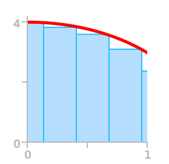
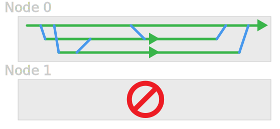
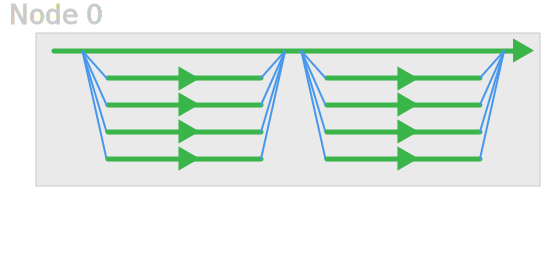

% HPC and HTC using Legion
% Research Computing and Facilitating Services

Legion Environment and Batch processing
=======================================

A Simple Serial Job
-------------------

`calculate_pi` - Calculates π by numerically integrating a curve.

$\int_{0}^{1}\frac{4}{1+x^2}\text{d}x=\pi$



Make a Copy
-----------

```bash
cd ~/Scratch
cp -r /shared/ucl/apps/examples/calculate_pi_dir ./
cd calculate_pi_dir
make
./calculate_pi
```


Job Script
----------

```bash
#!/bin/bash -l
#$ -P MyProjectName
#$ -l h_rt=0:10:00
#$ -cwd

./calculate_pi
```

Job Script Defaults
-------------------

Automatically assumes:

```bash
#$ -l memory=8G
#$ -l tmpfs=10G
```


Submitting Jobs to the Queue
----------------------------

    $ qsub submit.sh
    Your job 3521045 ("submit.sh") has been submitted
    
    $ qstat
    
    job-ID  prior   name       user         state submit/start at    
    -----------------------------------------------------------------
    3521045 0.00000 submit.sh  ccaaxxx      qw    01/14/2014 14:51:54
                    
    $ qstat -j 3521045
    
    $ qdel 3521045


Job States
----------

| Letter | Status |
|:--:|:---|
| `q` | queued |
| `w` | waiting |
| `r` | running |
| `E` | error |
| `t` | transferring |
| `h` | held |


Job States - Errors
-------------------

Most common problems:

 * Working directory does not exist
 * Working directory is not in `~/Scratch` (and thus not writable)

Note that `qstat -j` cuts off the end of the error message - try *e.g.* `qexplain 53893` to see full error message.


Environment Within a Job
------------------------

**Exercise**:  To see what environment variables are set by the scheduler, try making a job script that runs `env` and puts the output in a file. 


Environment Within a Job
------------------------

**Exercise**: Now `sort` the file, and compare it to your current environment to see what has changed. 

*(You'll need `sort`, and `env`. You may also want `less` and `sdiff`.)*


Multithreaded Jobs
---------------------




OpenMP
------




Make a Copy
-----------

* Go into your `Scratch` directory
* Make a copy of the `/shared/ucl/apps/examples/openmp_pi_dir` directory
* Build the program using `make`, and try running it


Something Like
--------------

```bash
cd ~/Scratch
cp -r /shared/ucl/apps/examples/openmp_pi_dir ./
cd openmp_pi_dir
make
./openmp_pi
```


Requesting Threads
------------------

```bash
#$ -l threads=4
```

**Exercise**: Try modifying the script from before to run the new program.

**Exercise**: Run versions with 1, 2, 3, and 4 cores, and compare the timings.


Job Script
----------

```bash
#!/bin/bash -l
#$ -P MyProjectName
#$ -l h_rt=0:10:00
#$ -l threads=4
#$ -cwd

./openmp_pi
```


Multi-node Jobs
---------------

* Need some method to communicate over the network
* Most common is **MPI**


MPI
---


Make a Copy
-----------

```bash
cd ~/Scratch
cp -r /shared/ucl/apps/examples/mpi_pi_dir ./
cd mpi_pi_dir
make
./mpi_pi
# (This won't work.)
```


Requesting Multinode Jobs
-------------------------

```bash
#$ -pe qlc 36
#$ -pe openmpi 36 
```

Note that each requested core gets the amount of memory requested.

**Exercise**: Try modifying the script from before to run the new program, using 4 cores and the `qlc` parallel environment.


Job Script
----------

```bash
#!/bin/bash -l
#$ -P MyProjectName
#$ -l h_rt=0:10:00
#$ -pe qlc 4
#$ -cwd

./mpi_pi
```

Requesting an Array Job
-----------------------

```bash
#$ -t 3     <- (only runs one job)
#$ -t 1-3
#$ -t 1-7:2
```

This queues an array of jobs which only differ in how the `$SGE_TASK_ID` variable is set.

**Exercise**: Try modifying the serial job script (`calculate_pi`) to run 4 jobs as an array. 

**Exercise**: `calculate_pi` can take an argument to tell it how many steps to use. Try controlling this with `$SGE_TASK_ID`.


Job Script
----------

```bash
#!/bin/bash -l
#$ -P MyProjectName
#$ -l h_rt=0:10:00
#$ -t 1-4
#$ -cwd

./calculate_pi ${SGE_TASK_ID}0
```


Job Arrays and File Performance
-------------------------------

The Lustre parallel filesystem performs ***worst*** when creating and writing to lots of little files.

Arrays of jobs often create files like this.

To help performance, run this type of job using the local storage on the node, and copy the files over when the job is complete.

**Local Storage**: `$TMPDIR`


Job Script
----------

```bash
#!/bin/bash -l
#$ -P MyProjectName
#$ -l h_rt=0:10:00
#$ -t 1-4
#$ -cwd

cd $TMPDIR
$HOME/my_programs/make_lots_of_files $SGE_TASK_ID

# Then either:
cp * $SGE_WORK_DIR

# or
cp -r $TMPDIR $SGE_WORK_DIR

# or, better for lots of files:
tar -cf $SGE_WORK_DIR/$JOB_NAME.$JOB_ID.$SGE_TASK_ID.tar $TMPDIR
```


Existing Applications
---------------------

*Modules* system helps to set up environment for applications.

Check `module avail` to see what modules exist.

    $ module avail
    ------------------ /shared/ucl/apps/modulefiles2/core ------------------
    curl/7.21.3/gnu       gnuplot/4.4.0      mrxvt/0.5.4        sge/6.2u3     
    curl/7.21.3/gnu.4.4.0 gold/2.2.0.5       nedit/5.6          sqlite/3.7.3 
    curl/7.21.3/gnu.4.6.3 grace/5.1.22       rcops/1.0          texlive/2010 
    [...]


Using Modules
-------------

Most modules add one or more programs to your `$PATH`.

    $ cmake
    -bash: cmake: command not found
    $ module load cmake
    $ cmake
    cmake version 2.8.3
    Usage

      cmake [options] <path-to-source>
    [...]
    $ module unload cmake
    $ cmake
    -bash: cmake: command not found


Module Contents
---------------

    $ module show cmake
    -------------------------------------------------------------------
    /shared/ucl/apps/modulefiles2/development/cmake/2.8.3:

    module-whatis    Adds cmake 2.8.3 to your environment 
    prepend-path     PATH /shared/ucl/apps/cmake-2.8.3-Linux-i386/bin 
    prepend-path     MANPATH /shared/ucl/apps/cmake-2.8.3-Linux-i386/man 
    -------------------------------------------------------------------


Prerequisites and Conflicts
---------------------------

    $ module load lammps/22oct10
    lammps/22oct10/qlogic/intel(27):ERROR:151: Module 
     'lammps/22oct10/qlogic/intel' depends on one of the module(s) 
     'fftw/2.1.5/double/intel'
    lammps/22oct10/qlogic/intel(27):ERROR:102: Tcl command execution failed: 
     prereq fftw/2.1.5/double/intel

    $ module show lammps/22oct10
    -------------------------------------------------------------------
    /shared/ucl/apps/modulefiles2/applications/lammps/22oct10/qlogic/intel:

    module-whatis    Adds LAMMPS 22Oct10 to your environment 
    prereq   compilers/intel 
    prereq   fftw/2.1.5/double/intel 
    prereq   mpi/qlogic/1.2.7/intel 
    conflict     lammps 
    prepend-path     PATH /shared/ucl/apps/lammps/lammps-22Oct10/bin 
    prepend-path     LD_LIBRARY_PATH /shared/ucl/apps/lammps/lammps-22Oct10/lib64 
    -------------------------------------------------------------------


Prerequisites Exercise
----------------------

**Exercise**: Successfully load the latest R module (`r/3.0.1-atlas/gnu.4.6.3`).


Recommended Bundles
-------------------

`recommended/r` loads a collection of other modules and then the R module.


Job Script
----------

```bash
#!/bin/bash -l
#$ -P MyProjectName
#$ -l h_rt=0:10:00
#$ -cwd

module unload compilers
module load recommended/r
# Generate a bunch of random numbers
R --no-save --slave <<INPUT >r.output.$JOB_ID
runif(50,0,1)
INPUT
```


Iridis & Emerald
----------------

These use a slightly different scheduler system, so the scripts are slightly different.

    #$ -pe qlc 24
    #PBS -l nodes=2:ppn=12

    #$ -l threads=12
    #PBS -l nodes=1:ppn=12

    #$ -l h_rt=1:00:00
    #PBS -l walltime=1:00:00

    #$ -l memory=4G
    #PBS -l mem=4gb

    #$ -P MyProject
    #PBS -q consort


Quick Reference Sheets
----------------------

Legion: [http://www.ucl.ac.uk/isd/staff/research_services/research-computing/services/legion-upgrade/legion_ref_sheet](http://www.ucl.ac.uk/isd/staff/research_services/research-computing/services/legion-upgrade/legion_ref_sheet)

Iridis: [http://www.ucl.ac.uk/isd/staff/research_services/research-computing/services/iridis/iridis_quick_reference](http://www.ucl.ac.uk/isd/staff/research_services/research-computing/services/iridis/iridis_quick_reference)


