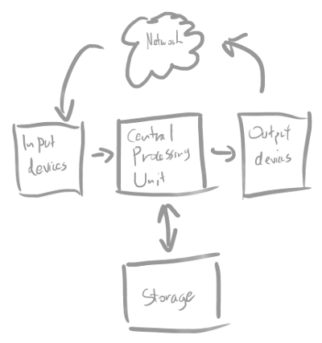

% High Performance Computing and High Throughput Computing using Legion
% Research Computing and Facilitating Services

Overview
========

Objectives
----------

* By the end of this course you should:

    * Understand key concepts around HPC and HTC

    * Be able to plan your work on Legion by:

        + Understanding Legion's hardware architecture

        + Understanding Legion's software stack

        + Writing simple Bash shell scripts

        + Writing job submission scripts to the batch scheduler

    * Be able to effectively use Research Computing services:

        + Learning about Research Computing structure and services

        + Issuing useful and successful support queries

HPC and HTC Concepts
====================

Key Concepts
------------

High Performance Computing (HPC)

High Throughput Computing (HTC)

AKA **"Supercomputing"**

The Computer
------------

Traditional view of a computer is changing
------------------------------------------

* Pressure from *computing requirements*.

* Pressure from *Physics*.

Pressure from computing requirements
------------------------------------

**Example:** Large scale weather simulation

* Detailed description for atmosphere too large to run on today's desktops.

    * Multiple "desktops" are needed to hold all grid data.

    * "Desktops" need to quickly *communicate to synchronise* work over entire grid,

    * Communication between "desktops" can become a bottleneck.
